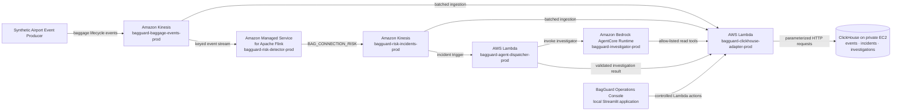

# BagGuard — Real-Time Baggage Connection Risk Investigator

**Repository:** `aws-realtime-baggage-connection-risk-investigator`

BagGuard is an event-driven airport operations platform that identifies checked baggage at risk of missing a connecting flight while ground teams still have time to intervene.

> Detect the miss before departure—not the lost bag after departure.

## Use case

A passenger's checked bag has arrived at a connection airport, but it is not progressing through the transfer process quickly enough to reach the outbound aircraft. BagGuard continuously correlates baggage scans with the latest flight timing, detects when the remaining connection window becomes critical, and gives an operator an evidence-based explanation of the likely operational cause.

The solution separates two decisions:

- **Streaming detection:** Is this bag running out of time to reach its connecting aircraft?
- **Contextual investigation:** Why is it at risk, how broad is the issue, and what should operations investigate or prioritize?

This separation keeps the streaming rule deterministic while allowing the investigation layer to compare the affected bag with peer bags, transfer-zone activity, and inbound-flight timing. The resulting actions are recommendations only. BagGuard does not move bags, change routes or gates, alter schedules, contact passengers, or write to airport and airline operational systems.

### Operational outcomes

| Operating condition | Streaming outcome | Investigation outcome |
|---|---|---|
| Bag reaches the connecting aircraft in time | No risk incident | No investigation required |
| One bag stalls while peers progress | `BAG_CONNECTION_RISK` | Isolated scope; targeted search or expedited handling |
| Multiple bags stall in the same transfer zone | `BAG_CONNECTION_RISK` for each affected bag | Zone-level scope; inspect the transfer path and coordinate manual handling |
| Inbound arrival compresses the connection window | `BAG_CONNECTION_RISK` | Flight-level scope; prioritize hot-connection baggage |

## Navigation

- [Architecture](#architecture)
- [How data is processed](#how-data-is-processed)
- [Baggage lifecycle](#baggage-lifecycle)
- [Data model](#data-model)
- [Security boundaries](#security-boundaries)
- [Resource naming](#resource-naming)
- [Repository layout](#repository-layout)
- [Local operations](#local-operations)
- [Cost profile](#cost-profile)
- [Key assumptions](#key-assumptions)

## Architecture



### Component responsibilities

| Component | Responsibility |
|---|---|
| Airport event producer | Publishes synthetic baggage lifecycle events using `bag_tag_id` as the partition key. |
| Baggage event stream | Provides the ordered event path used by both the detector and the analytical store. |
| Managed Flink detector | Maintains per-bag state, evaluates connection timers, and emits one deterministic `BAG_CONNECTION_RISK` incident when action time is running out. |
| Risk incident stream | Decouples real-time detection from persistence and contextual investigation. |
| ClickHouse adapter | Performs batched ingestion, exposes allow-listed parameterized queries, and persists validated investigation results. |
| ClickHouse | Serves current operational state and historical context from the same analytical store. |
| Dispatcher | Validates an incident, invokes AgentCore, validates the structured response, and coordinates persistence. |
| AgentCore investigator | Compares the bag journey with flight, peer-bag, and transfer-zone evidence to identify likely cause, scope, priority, and a recommended response. |
| Operations Console | Presents flight timing, baggage progress, risk, evidence, investigation status, and airport context without connecting directly to ClickHouse. |

## How data is processed

1. **Capture:** the producer sends a baggage milestone to `bagguard-baggage-events-prod` with a stable event identifier and a `bag_tag_id` partition key.
2. **Persist:** `bagguard-clickhouse-adapter-prod` consumes event batches and inserts them into `bagguard.baggage_events`.
3. **Detect:** `bagguard-risk-detector-prod` correlates milestones per bag and registers a timer against the latest effective outbound departure time.
4. **Suppress:** if `MAKEUP_AREA_SCAN` or `CONNECTING_AIRCRAFT_LOADED` arrives before the risk boundary, the detector does not emit an incident.
5. **Signal:** when the boundary is reached without sufficient progress, Flink emits exactly one deterministic `BAG_CONNECTION_RISK` to `bagguard-risk-incidents-prod`.
6. **Investigate:** `bagguard-agent-dispatcher-prod` invokes `bagguard-investigator-prod`, which reads only the evidence it needs through controlled adapter tools.
7. **Store:** the dispatcher validates the structured response and asks the adapter to save it in `bagguard.investigation_results`.
8. **Present:** the local Operations Console polls the adapter and shows the live bag journey, incident, evidence, scope, priority, and recommended action.

Flink never guesses the root cause. The investigator never re-detects the risk. This boundary ensures that identical high-level risk incidents can produce different, evidence-backed operational findings.

## Baggage lifecycle

```mermaid
flowchart LR
    A[BAG_ACCEPTED] --> B[ORIGIN_SORTED]
    B --> C[ORIGIN_AIRCRAFT_LOADED]
    C --> D[TRANSFER_ARRIVED]
    D --> E[TRANSFER_SORTER_SCAN]
    E --> F[MAKEUP_AREA_SCAN]
    F --> G[CONNECTING_AIRCRAFT_LOADED]
    G --> H[DESTINATION_ARRIVED]

    classDef connection fill:#e7f5ff,stroke:#1479a8,color:#082f49,stroke-width:2px;
    class D,E,F,G connection;
```



The intervention window is the connection-airport segment from `TRANSFER_ARRIVED` through `CONNECTING_AIRCRAFT_LOADED`. Risk thresholds are configuration, not airport service-level commitments.

## Data model

ClickHouse is the unified analytical serving layer:

- `baggage_events` stores immutable lifecycle scans and flight-transfer context.
- `baggage_risk_incidents` stores deterministic detector output and its timing evidence.
- `investigation_results` stores classification, likely cause, scope, evidence, operational priority, and the recommended action.

All paths assume at-least-once delivery. Events and incidents use stable identifiers, inserts are batched, and consumers are designed to tolerate duplicate and out-of-order records.

## Security boundaries

- ClickHouse runs on Amazon Linux 2023 ARM64 in a VPC and has no public inbound access.
- TCP `8123` is allowed only from `bagguard-adapter-sg-prod`; TCP `9000` and SSH have no ingress rules.
- EC2 administration is performed through AWS Systems Manager; no SSH key pair is configured.
- Credentials are generated in `bagguard/clickhouse/prod` and are never stored in source control.
- AgentCore has no EC2 permissions, database credentials, or direct ClickHouse network path.
- Agent tools invoke only `bagguard-clickhouse-adapter-prod` and expose no arbitrary SQL action.
- The dispatcher can invoke only the BagGuard AgentCore runtime and the adapter Lambda.
- The dashboard uses locally configured AWS credentials to invoke controlled Lambda actions; it never connects directly to ClickHouse.
- All passenger, baggage, flight, and airport records generated by this repository are synthetic.

## Resource naming

Operator-facing production resources use the convention `bagguard-{component}-prod`. Globally unique resources append the AWS account and Region, while hierarchical resources use `/bagguard/prod/{component}`. Framework-generated helper resources retain generated physical names and inherit the stack tags.

| Resource | Name |
|---|---|
| CDK stack | `BagGuardProductionStack` |
| VPC | `bagguard-vpc-prod` |
| Baggage event stream | `bagguard-baggage-events-prod` |
| Risk incident stream | `bagguard-risk-incidents-prod` |
| Flink application | `bagguard-risk-detector-prod` |
| Flink artifact bucket | `bagguard-flink-artifacts-prod-{account}-{region}` |
| ClickHouse EC2 name | `bagguard-clickhouse-prod` |
| ClickHouse IAM role | `bagguard-clickhouse-role-prod` |
| ClickHouse security group | `bagguard-clickhouse-sg-prod` |
| Adapter security group | `bagguard-adapter-sg-prod` |
| Adapter Lambda | `bagguard-clickhouse-adapter-prod` |
| Dispatcher Lambda | `bagguard-agent-dispatcher-prod` |
| AgentCore runtime | `bagguard-investigator-prod` |
| ClickHouse secret | `bagguard/clickhouse/prod` |
| CloudWatch log groups | `/bagguard/prod/{component}` |

All stack resources carry these tags:

```text
Project=BagGuard
Environment=prod
Workload=BaggageConnectionRisk
Owner=BaggageOperations
```

## Repository layout

```text
aws-realtime-baggage-connection-risk-investigator/
├── README.md
├── AGENTS.md
├── Makefile
├── .env.example
├── infra/                         # AWS CDK application and production stack
├── simulator/                     # Synthetic event producer and scenario runner
├── flink/                         # Stateful connection-risk detector
├── lambdas/
│   ├── clickhouse_adapter/        # Batched ingestion and controlled data access
│   └── dispatcher/                # Incident investigation orchestration
├── agent/                         # Investigator logic and tool contracts
├── agentcore/                     # AgentCore Runtime packaging and deployment config
├── dashboard/                     # Local Streamlit operations interface
├── tests/                         # Unit, contract, infrastructure, and scenario tests
└── scripts/                       # Packaging, lifecycle, and validation utilities
```

## Local operations

Create the local environment and validate the repository:

```bash
python3 -m venv .venv
.venv/bin/python -m pip install -r infra/requirements.txt
make validate
make test
make synth
```

Operate the provisioned compute without deleting retained data or infrastructure:

```bash
make platform-start
make platform-status
make platform-stop
```

Run synthetic operating conditions through the live event path:

```bash
make scenario-normal
make scenario-isolated
make scenario-zone
make scenario-delay
```

Start the local console:

```bash
make dashboard
```

See [scripts/README.md](scripts/README.md) for lifecycle safeguards, [simulator/README.md](simulator/README.md) for event generation, and [dashboard/README.md](dashboard/README.md) for console configuration.

## Cost profile

The principal baseline cost drivers are the continuously running Managed Flink application, the ClickHouse EC2 instance, EBS storage, and any VPC interface endpoints. Variable cost is driven by Kinesis throughput, Lambda duration, AgentCore runtime use, model tokens, logging, and data transfer.

The supplied `platform-start` and `platform-stop` commands control Flink and EC2 while preserving streams, EBS, AgentCore, CloudFormation, and logs. EBS, Kinesis, retained logs, secrets, and other provisioned services may continue to incur charges while compute is stopped.

Before operating in a new Region, create a region-specific estimate using current AWS pricing and expected event volume, retention, runtime hours, model usage, recovery objectives, and availability requirements.

## Key assumptions

- The selected AWS Region supports the required Managed Flink runtime, AgentCore Runtime, Bedrock foundation model, Lambda runtime, and Graviton instance type.
- Producers partition events by `bag_tag_id`; event time is authoritative and all stored timestamps use UTC.
- Operational thresholds differ by airport, terminal, carrier, and connection type and remain configurable.
- Kinesis can retain incoming events while downstream compute is stopped, subject to retention and restart catch-up capacity.
- The current ClickHouse profile is a cost-controlled single-node, single-AZ deployment. Workloads with strict availability or recovery requirements must add redundancy, backup validation, observability, and capacity planning appropriate to their service objectives.
- Agent findings are advisory and evidence-based. Human operators own every intervention decision.

## Technology baseline

- Python 3.14 for CDK and Lambda where supported
- Python 3.12 for the Managed Apache Flink 2.3 application
- AWS CDK for Python and `boto3`
- Amazon Kinesis Data Streams
- Amazon Managed Service for Apache Flink
- Amazon Bedrock AgentCore Runtime and Strands Agents
- AWS Lambda
- ClickHouse on EC2 Graviton with encrypted gp3 EBS
- AWS Systems Manager, Secrets Manager, Amazon SQS, and CloudWatch
- Streamlit
